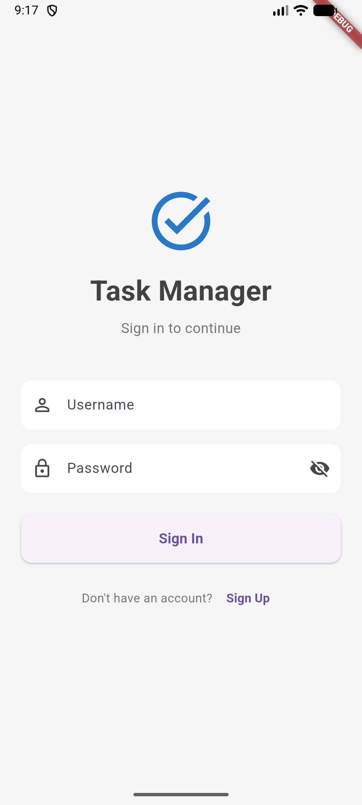
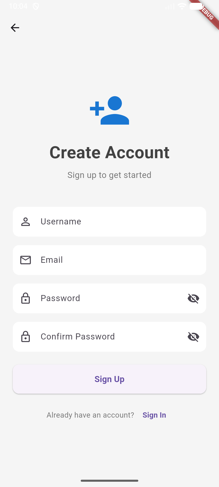
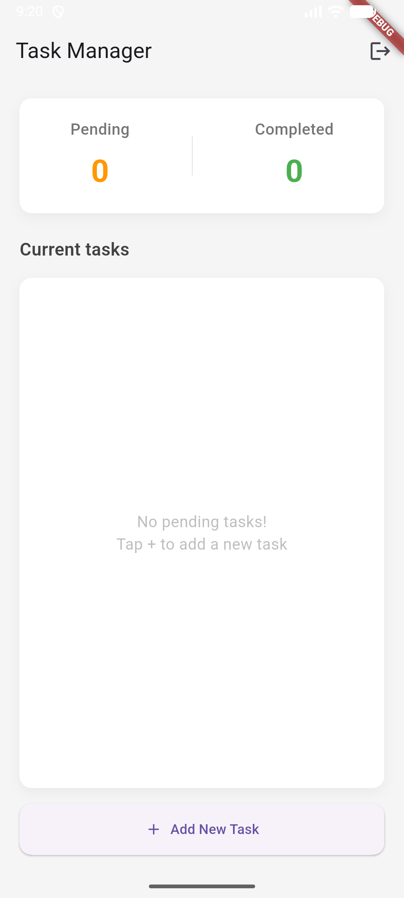
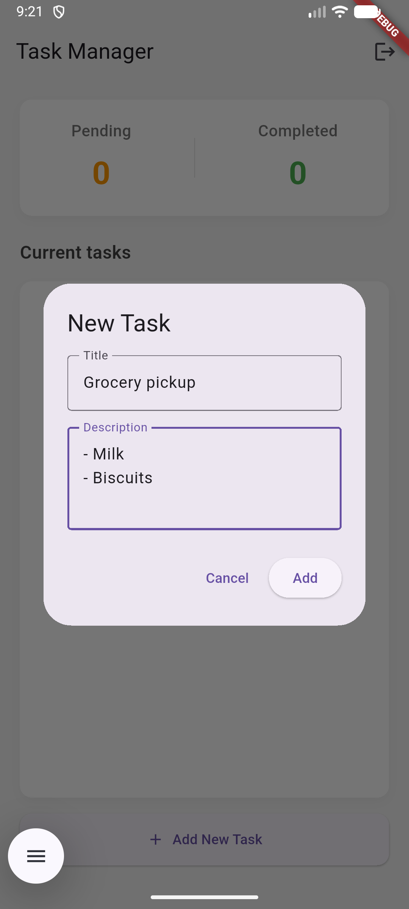
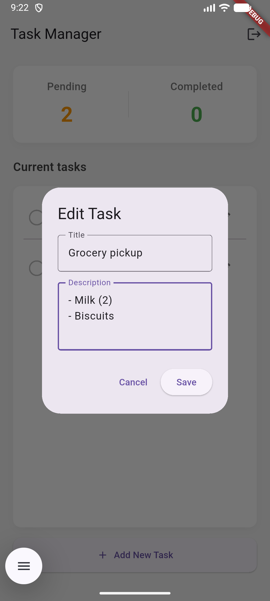
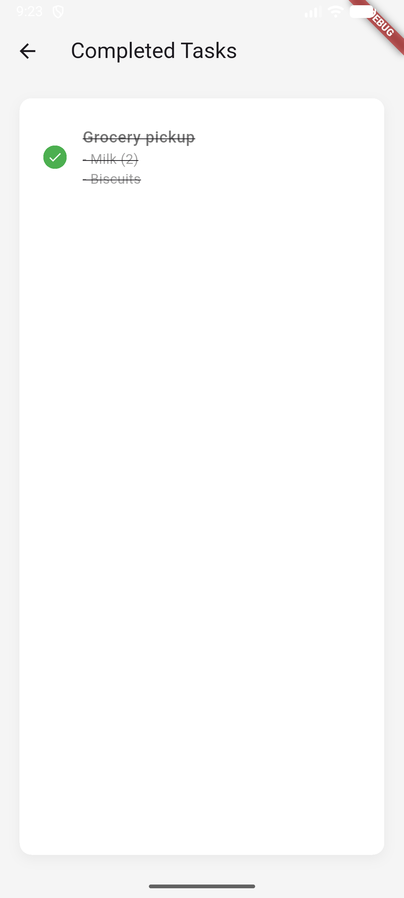

# Task Manager App with Back4App Authentication

A Flutter task manager application with user authentication powered by Back4App (Parse Server).

## Features

- User Sign Up & Sign In
- Task Management (Add, Edit, Complete and Delete)

## Setup Instructions

### STEP 1: Fetch Back4App Credentials

1. Go to [Back4App](https://www.back4app.com/) and create a free account
2. Create a new app
3. Go to **App Settings** → **Security & Keys**
4. Copy your:
   - **Application ID**
   - **Client Key**

### STEP 2. Configure the credentials in the Flutter app

Open `lib/main.dart` and replace the placeholder credentials:

```dart
const keyApplicationId = 'YOUR_APP_ID';
const keyClientKey = 'YOUR_CLIENT_KEY';
const keyParseServerUrl = 'https://parseapi.back4app.com';
```

### STEP 4. Install Dependencies

```bash
flutter pub get
```

### 4. Run the App

```bash
# For Android emulator (Ensure to create Emulator)
flutter run -d android

# For macOS
flutter run -d macos

# For Web
flutter run -d chrome
```

## Dependencies

- `flutter`: Flutter SDK
- `parse_server_sdk_flutter`: Back4App Parse SDK for authentication and data storage

## Screenshots

### Authentication

| Login Screen | Sign Up Screen |
|:---:|:---:|
|  |  |

### Task Management

| Empty Task List | Add Task Dialog | Edit Tasks | Task Completed |
|:---:|:---:|:---:|:---:|
|  |  |  |   |


## Key Features

- Login screen with username and password fields
- Sign up screen with form validation
- Task manager with pending/completed counters
- Add/Edit tasks with title and description
- Swipe-to-delete functionality
- Logout option
